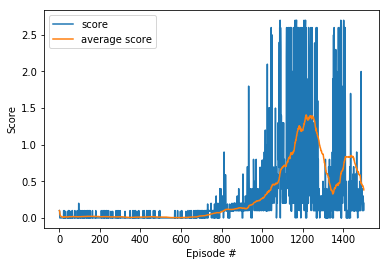

**Udacity's Deep Reinforcement Learning Nanodegree**

## Report on Collaboration and Competition project

Multi-Agent Deep Deterministic Policy Gradient (MADDPG) is used to train 2 agents to solve the tennis environment.  MADDPG is a kind of "Actor-Critic" method. Unlike DDPG algorithm which trains each agent independantly, MADDPG trains actors and critics using all agents information (actions and states). However, the trained agent model (actor) can make an inference independently using its own state.

#### Model architecture

**1. Actor network**

The actor network is a multi-layer perceptron (MLP) with 2 hidden layers, which maps states to actions.

   * Input Layer —> 1st hidden layer (256 neurons, ReLu) —> Batch Normalization —> 2nd hidden layer (128 neurons, ReLu) —> Output layer (tanh)

```py
class Actor(nn.Module):
    """Actor (Policy) Model."""

    def __init__(self, state_size, action_size, seed=0, fc1_units=256, fc2_units=128):
        super(Actor, self).__init__()
        self.seed = torch.manual_seed(seed)
        self.fc1 = nn.Linear(state_size, fc1_units)
        self.fc2 = nn.Linear(fc1_units, fc2_units)
        self.fc3 = nn.Linear(fc2_units, action_size)
        self.bn1 = nn.BatchNorm1d(fc1_units)
        self.bn2 = nn.BatchNorm1d(fc2_units)
        self.reset_parameters()
        
    def forward(self, state):
        if state.dim() == 1:
            state = torch.unsqueeze(state,0)
        x = F.relu(self.fc1(state))
        x = self.bn1(x)
        x = F.relu(self.fc2(x))
        return torch.tanh(self.fc3(x))
        
```


**2. Critic network**

The critic network is also a multi-layer perceptron (MLP) with 2 hidden layers, which maps (state, action) pair to Q-value.

#### Training algorithm

1. The agents using the current policy and exploration noise interact with the environment, and the episodes are saved into the shared replay buffer.
2. For each agent, using a minibatch which is randomly selected from the reply buffer, the critic and the actor are trained using MADDPG training algorithm.
3. Target networks of actor and critic of agents are soft-updated respectively.

##### Additional resource on DDPG
- [Multi-Agent Actor-Critic for Mixed Cooperative-Competitive Environments](https://arxiv.org/abs/1706.02275)

### Train two agents

After different configuration on hyper-parameters and noise for action exploration, the below set solves the environment. Firstly, I used Ornstein-Uhlenbeck for noise, but I switched to random noise with standard normal distribution, which works for my case.

#### Hyper parameters

- Replay buffer size : 100000
- Minibatch size : 256
- Discount factor : 0.99
- Soft update of target parameter : 0.001
- Learning rate of the actor : 0.0001
- Learning rate of the critic : 0.0003

**Result**: The score is hardly increased in the early phase, and spikes after 900th episode. After hitting the highest score above 2.7, it drops suddenly down to 0.1 or lower. Average score over 100 episodes reaches 0.503 at 1079th episode, which is considered to solve the environment.

   ```
0 episode	avg score 0.10000	max score 0.10000
100 episode	avg score 0.01550	max score 0.00000
200 episode	avg score 0.01770	max score 0.00000
300 episode	avg score 0.01660	max score 0.00000
400 episode	avg score 0.01060	max score 0.00000
500 episode	avg score 0.01280	max score 0.00000
600 episode	avg score 0.00390	max score 0.00000
700 episode	avg score 0.02740	max score 0.10000
800 episode	avg score 0.08620	max score 0.10000
900 episode	avg score 0.13380	max score 0.00000
1000 episode	avg score 0.27040	max score 0.20000
1079 episode	avg score 0.50310	max score 0.79000
Environment solved after 1079 episodes with the average score 0.5031000076048077

1100 episode	avg score 0.69040	max score 0.50000
1200 episode	avg score 1.21570	max score 2.60000
1300 episode	avg score 0.84530	max score 0.20000
1400 episode	avg score 0.72370	max score 2.70000
1499 episode	avg score 0.38330	max score 0.20000
   ```

**Plot of reward**




### Ideas for Future work

``` 
The reward earned is very unstable, we need to properly normalize the reward while appending to the replay buffer.

We need to sample most important experiences to replay and not just a blind sample.

It is seen that little change in hyperparams delays convergence by several episodes. So hyperparameter optimization can be enhanced by use of bayesian optimization.
```